# light-modern.nvim

Neovim ports of Visual Studio Code's default **Light Modern** and **Dark Modern**
themes.

Colours are transcribed from VS Code's built-in `theme-defaults` extension —
`light_modern.json` and `dark_modern.json`, each layered over the matching
`*_plus.json` and `*_vs.json` — rather than eyeballed from screenshots.

| | Light Modern | Dark Modern |
| --- | --- | --- |
| Background | `#ffffff` | `#1f1f1f` |
| Accent | `#005fb8` | `#0078d4` |
| Comments | `#008000` | `#6a9955` |
| Keywords | `#0000ff` | `#569cd6` |
| Control flow | `#af00db` | `#c586c0` |
| Strings | `#a31515` | `#ce9178` |
| Functions | `#795e26` | `#dcdcaa` |
| Types | `#267f99` | `#4ec9b0` |
| Variables | `#001080` | `#9cdcfe` |

Requires Neovim >= 0.8 with `termguicolors`.

<p align="center">
  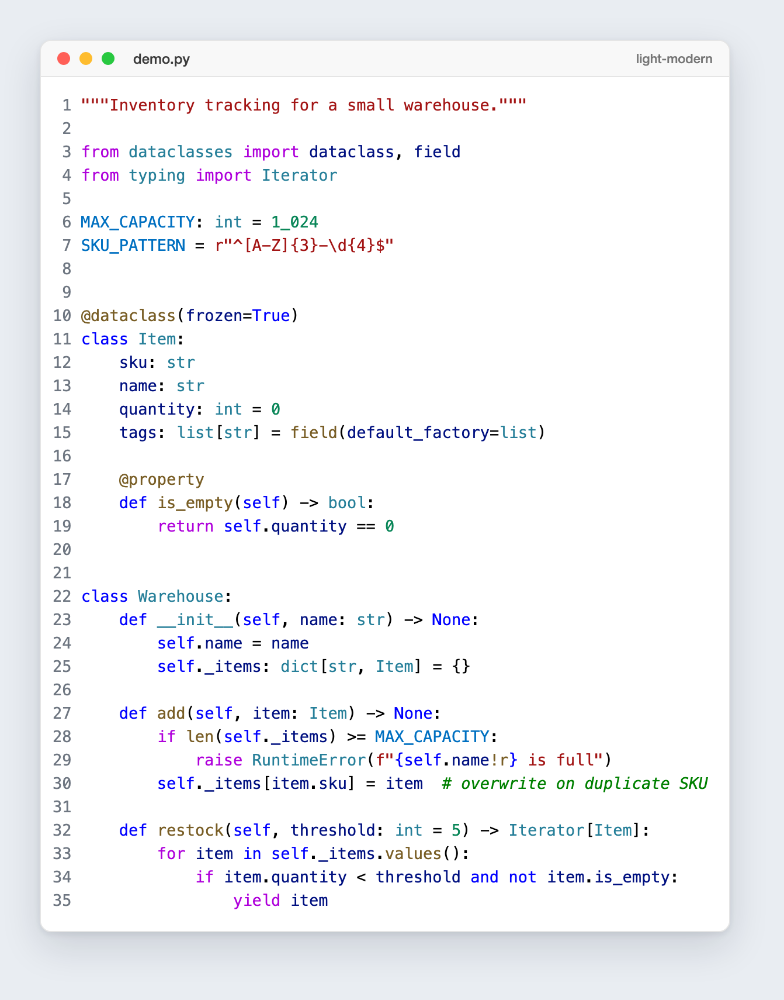
  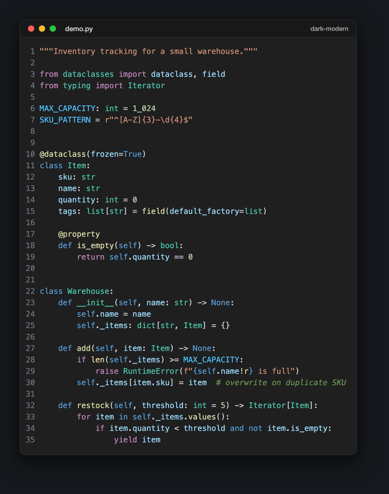
</p>

<details>
<summary><b>More languages</b> — TypeScript, C, C++, Java, Lua</summary>
<br>

| | Light Modern | Dark Modern |
| :--: | :--: | :--: |
| **TypeScript** | 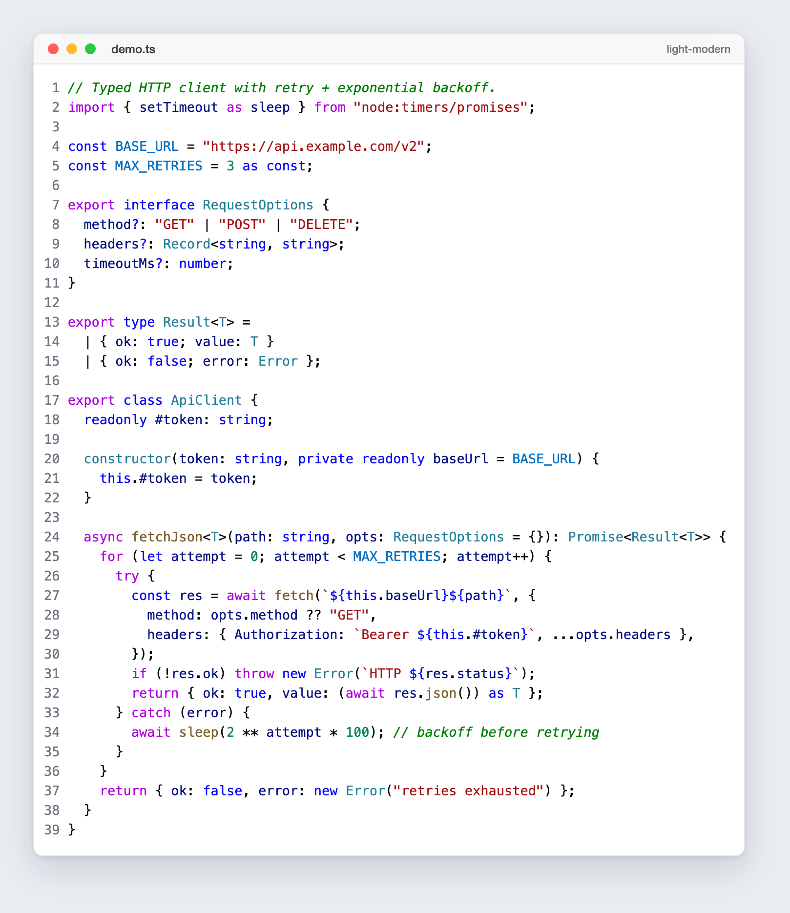 | 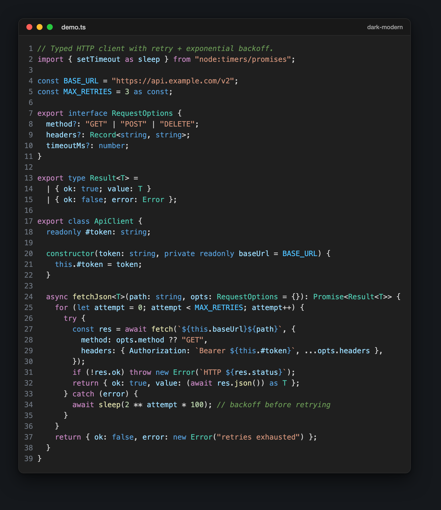 |
| **C** | 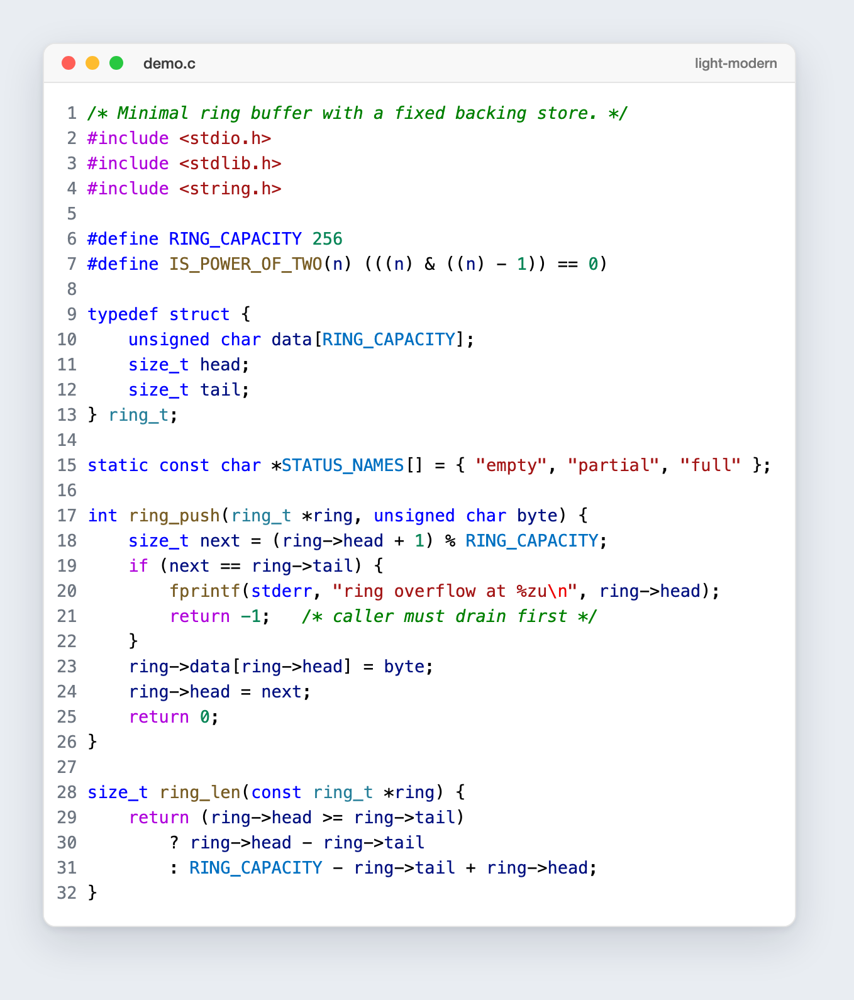 | 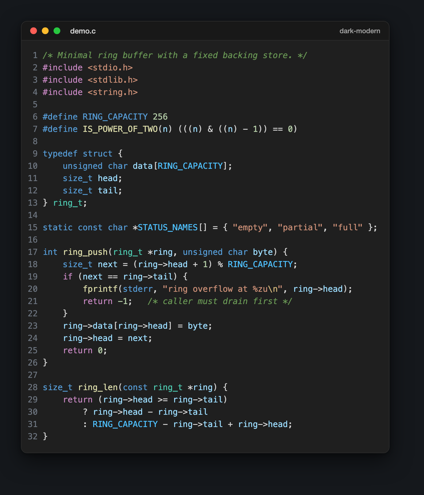 |
| **C++** | 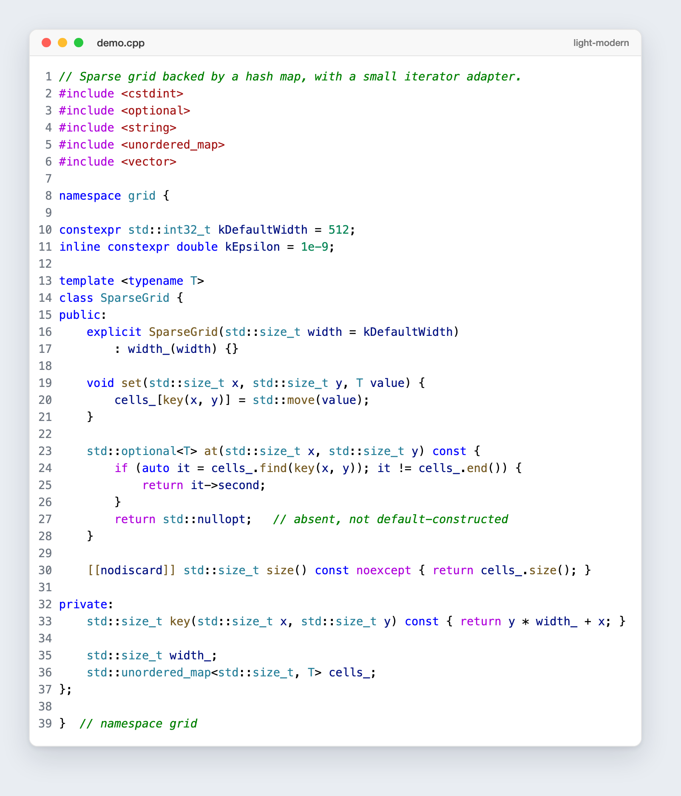 | 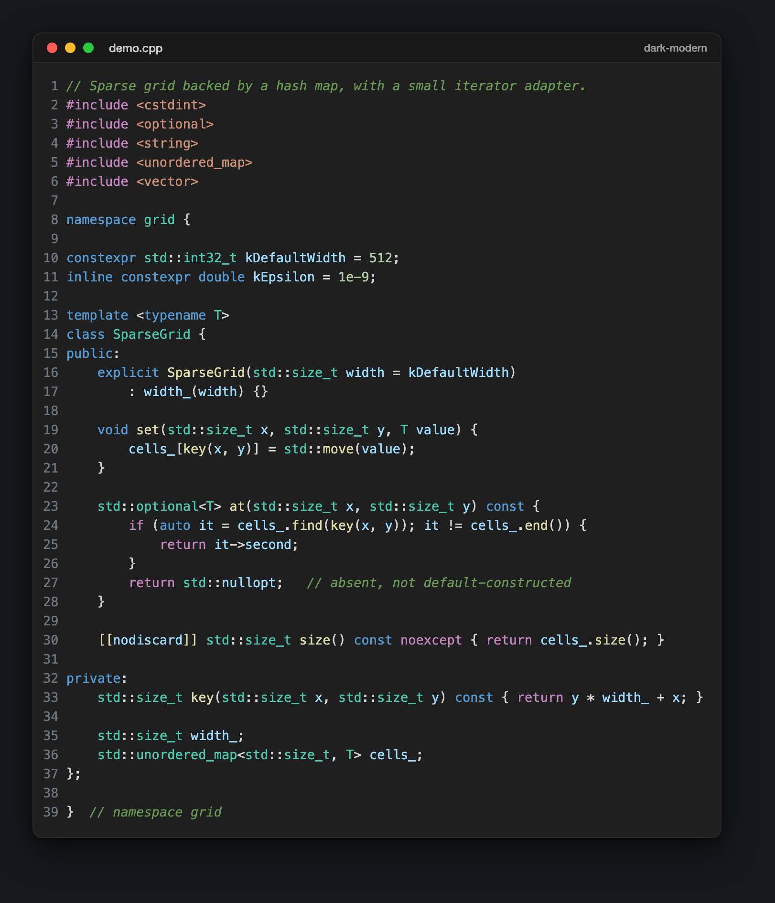 |
| **Java** | 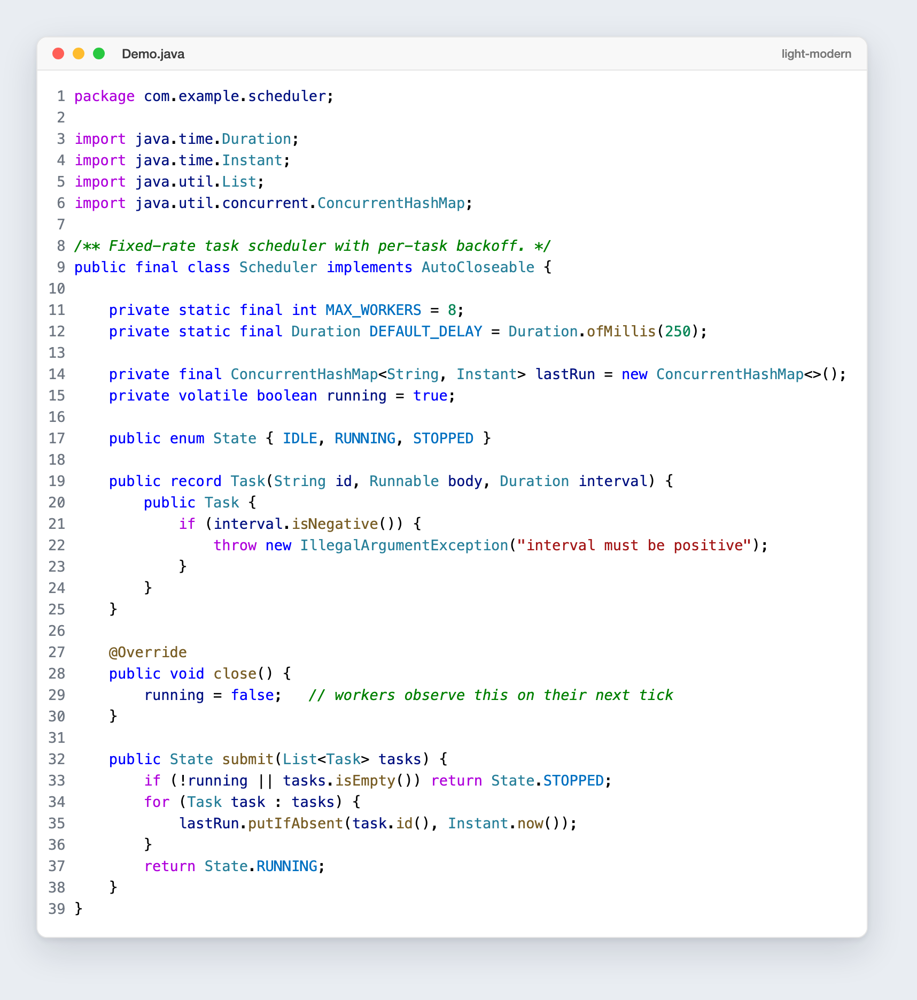 | 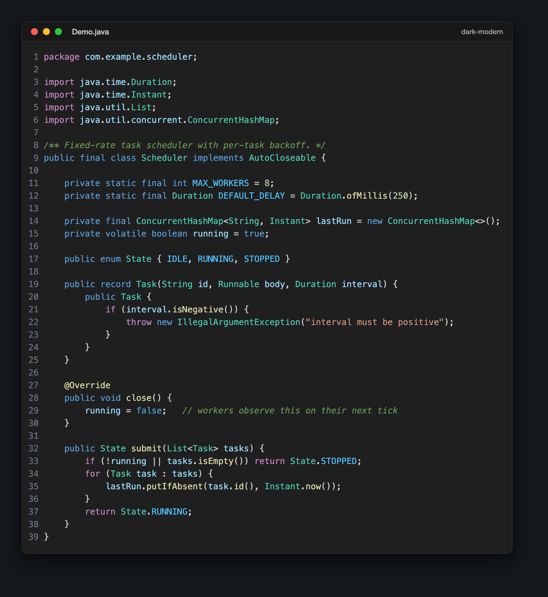 |
| **Lua** | 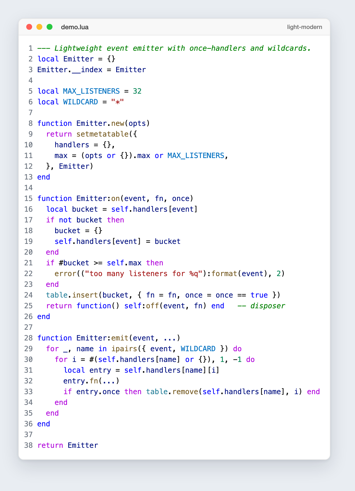 | 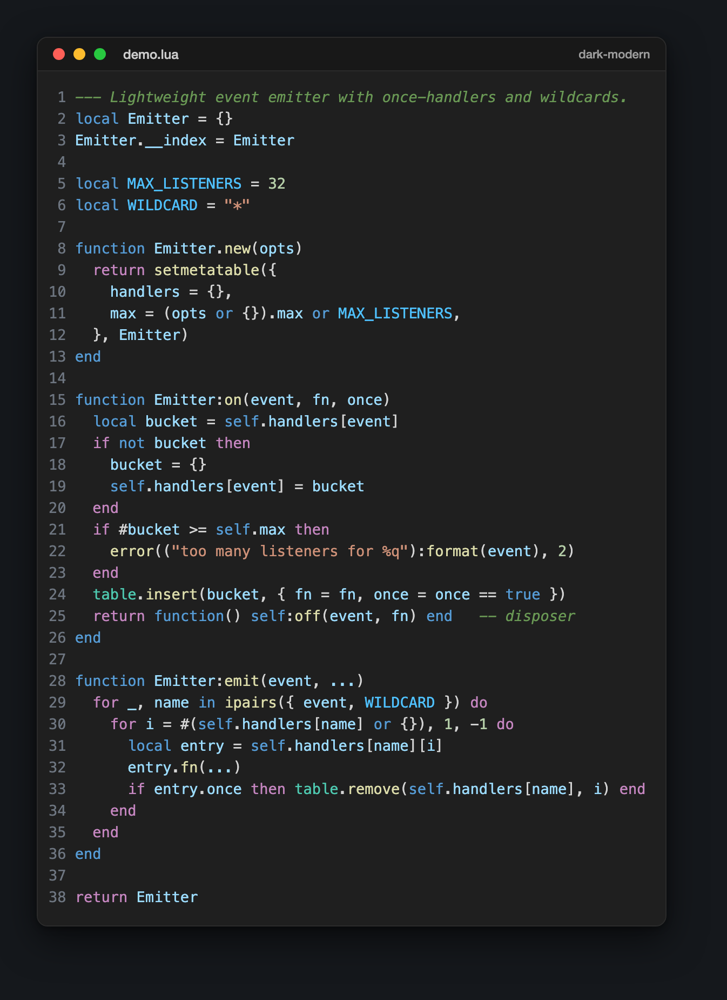 |

</details>

> Every screenshot is generated straight from Neovim with `:TOhtml`, so the
> colours are exactly what the colorschemes produce — nothing is hand-tuned for
> the README.

## Install (lazy.nvim)

```lua
{
  "AZ9tumas/light-modern.nvim",
  lazy = false,
  priority = 1000,
  opts = {},
  config = function(_, opts)
    require("light-modern").setup(opts)
    vim.cmd.colorscheme("light-modern") -- or "dark-modern"
  end,
}
```

Two colorschemes are registered:

```vim
colorscheme light-modern
colorscheme dark-modern
```

Either one sets `vim.o.background` for you, so plugins that key off it behave.

Using LazyVim? Set it as the colorscheme instead of calling `vim.cmd`:

```lua
{
  { "AZ9tumas/light-modern.nvim", lazy = false, priority = 1000, opts = {} },
  { "LazyVim/LazyVim", opts = { colorscheme = "dark-modern" } },
}
```

Running it from a local checkout (no repo needed):

```lua
{
  dir = vim.fn.expand("~/Desktop/light-modern.nvim"),
  name = "light-modern",
  lazy = false,
  priority = 1000,
  opts = {},
  config = function(_, opts)
    require("light-modern").setup(opts)
    vim.cmd.colorscheme("light-modern")
  end,
}
```

Other managers:

```lua
-- packer.nvim
use({ "AZ9tumas/light-modern.nvim" })

-- vim-plug
Plug 'AZ9tumas/light-modern.nvim'
```

## Configuration

`setup()` is optional — every value below is the default.

```lua
require("light-modern").setup({
  style = "light",          -- default palette; :colorscheme overrides it
  transparent = false,      -- drop the editor background
  terminal_colors = true,   -- recolour :terminal with VS Code's ANSI palette
  dim_inactive = false,     -- shaded chrome background on unfocused splits
  ending_tildes = false,    -- show `~` past the end of the buffer
  cursorline = true,        -- subtle fill on the cursor line

  styles = {
    comments     = { italic = true },
    keywords     = {},
    conditionals = {},
    functions    = {},
    variables    = {},
    types        = {},
    strings      = {},
    numbers      = {},
    booleans     = {},
    parameters   = {},
    properties   = {},
    operators    = {},
  },

  diagnostics = {
    undercurl = true,       -- undercurl instead of underline
    background = true,      -- tinted background behind virtual text
  },

  -- filetypes that get the panel background instead of the editor background
  sidebars = { "NvimTree", "neo-tree", "help", "qf", "lazy", "mason", "trouble" },

  on_colors = function(colors) end,
  on_highlights = function(highlights, colors) end,
})
```

Pick a theme with `:colorscheme light-modern` or `:colorscheme dark-modern` —
the name always wins over `style`, so you can switch at runtime without
re-running `setup()`.

Any style table accepts the attributes `nvim_set_hl` understands — `italic`,
`bold`, `underline`, `undercurl`, `strikethrough`, `reverse`, `nocombine`.

### Overriding colours and highlights

```lua
require("light-modern").setup({
  on_colors = function(colors)
    colors.comment = "#6a9955"
  end,
  on_highlights = function(hl, colors)
    hl.CursorLine = { bg = "#f0f0f0" }
    hl["@keyword.return"] = { fg = colors.control, bold = true }
  end,
})
```

Both hooks run for whichever style is active. The palette is also available
directly:

```lua
local colors = require("light-modern").colors()        -- active style
local dark   = require("light-modern").colors("dark")  -- a specific one
```

## lualine

```lua
require("lualine").setup({
  options = { theme = "light-modern" }, -- or "dark-modern"
})
```

## What's covered

* Core editor UI, statusline, tabline, popup menu, diffs, spelling, folds
* Legacy `:syntax` groups and the full tree-sitter capture set, including
  language tweaks (JSON/YAML keys, HTML attribute values, CSS selectors,
  Python builtins)
* LSP diagnostics, references, inlay hints, and semantic tokens
* gitsigns, telescope, fzf-lua, nvim-tree, neo-tree, oil, nvim-cmp, blink.cmp,
  bufferline, indent-blankline, which-key, noice, nvim-notify, snacks, trouble,
  todo-comments, lazy, mason, dap/dap-ui, flash, leap, hop, mini.nvim, alpha,
  dashboard, treesitter-context, rainbow-delimiters, navic, aerial, scrollbar,
  harpoon, diffview, neogit, copilot, render-markdown

## Layout

```
light-modern.nvim
├── colors/
│   ├── light-modern.lua              :colorscheme light-modern
│   └── dark-modern.lua               :colorscheme dark-modern
├── lua/light-modern/
│   ├── init.lua                      setup() / load() / colors()
│   ├── config.lua                    defaults
│   ├── palette.lua                   both palettes, annotated with VS Code keys
│   ├── theme.lua                     builds and applies the highlight table
│   ├── lualine.lua                   shared lualine theme builder
│   ├── util.lua                      blend / darken / lighten helpers
│   └── groups/
│       ├── editor.lua
│       ├── syntax.lua
│       ├── treesitter.lua
│       ├── lsp.lua
│       └── plugins.lua
└── lua/lualine/themes/
    ├── light-modern.lua
    └── dark-modern.lua
```

Every highlight group is defined from palette keys only, so the same group
definitions produce both themes — a fix in one lands in the other.

## Licence

MIT. Colour values originate from Microsoft's VS Code default themes, which are
MIT licensed.
